# 跨平台AI终端工具设计文档

## 1. 项目概述

### 1.1 项目目标
开发一款跨平台的AI终端管理工具，集成SSH资产管理、文件传输、AI交互和安全管控功能，为企业和个人用户提供智能化的服务器管理解决方案。

### 1.2 核心价值
- **智能化运维**：通过AI辅助简化复杂的命令行操作
- **安全可控**：提供完善的权限管控和审计机制
- **跨平台统一**：在不同操作系统上提供一致的用户体验
- **企业友好**：支持本地部署和数据安全保护

### 1.3 技术栈
- **前端框架**: Electron + Vue.js
- **后端框架**: Node.js + Koa.js
- **数据存储**: SQLite (本地数据库)
- **加密算法**: AES-256 (本地敏感数据加密)
- **SSH协议**: node-ssh库
- **FTP协议**: node-ftp库
- **AI集成**: OpenAI API / 本地大模型

## 2. 系统架构

### 2.1 整体架构图

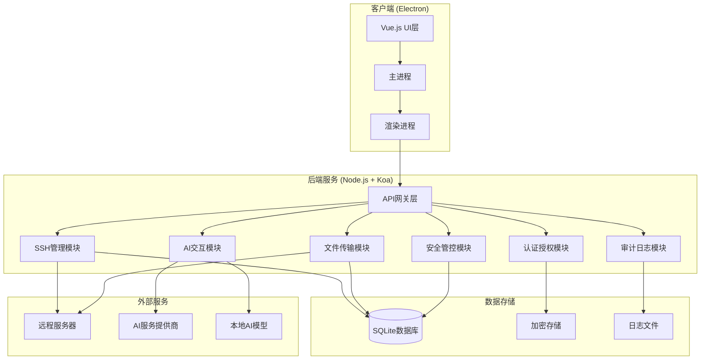

### 2.2 模块分层架构

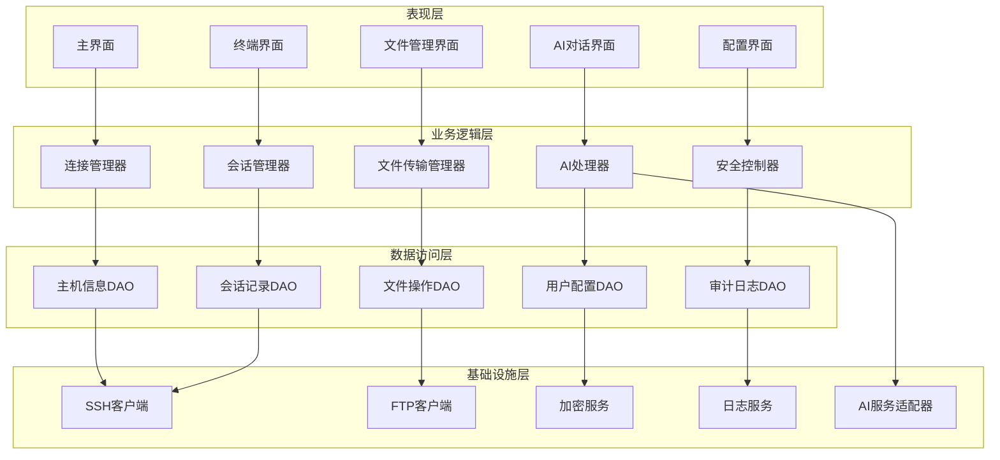

## 3. 核心功能模块设计

### 3.1 SSH资产管理模块

#### 3.1.1 主机信息管理
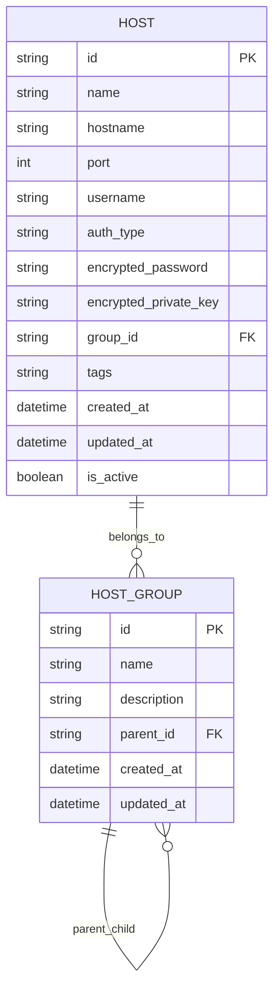

#### 3.1.2 连接管理流程
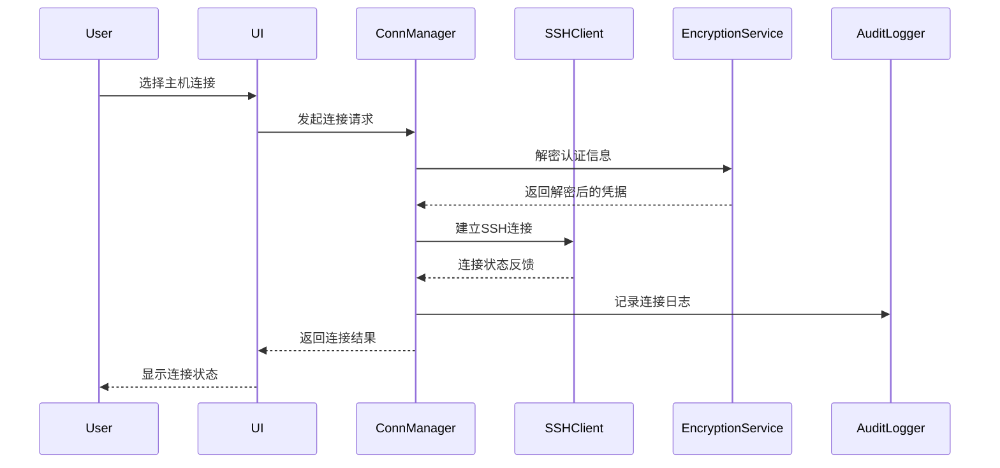

### 3.2 文件传输模块

#### 3.2.1 传输任务管理
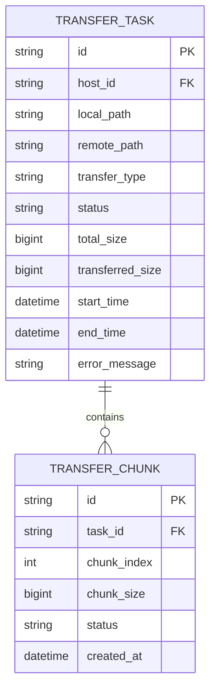

#### 3.2.2 断点续传机制
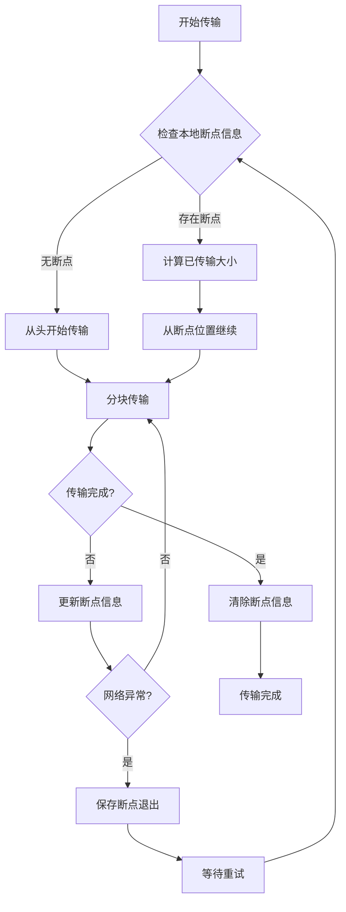

### 3.3 AI交互模块

#### 3.3.1 AI服务架构
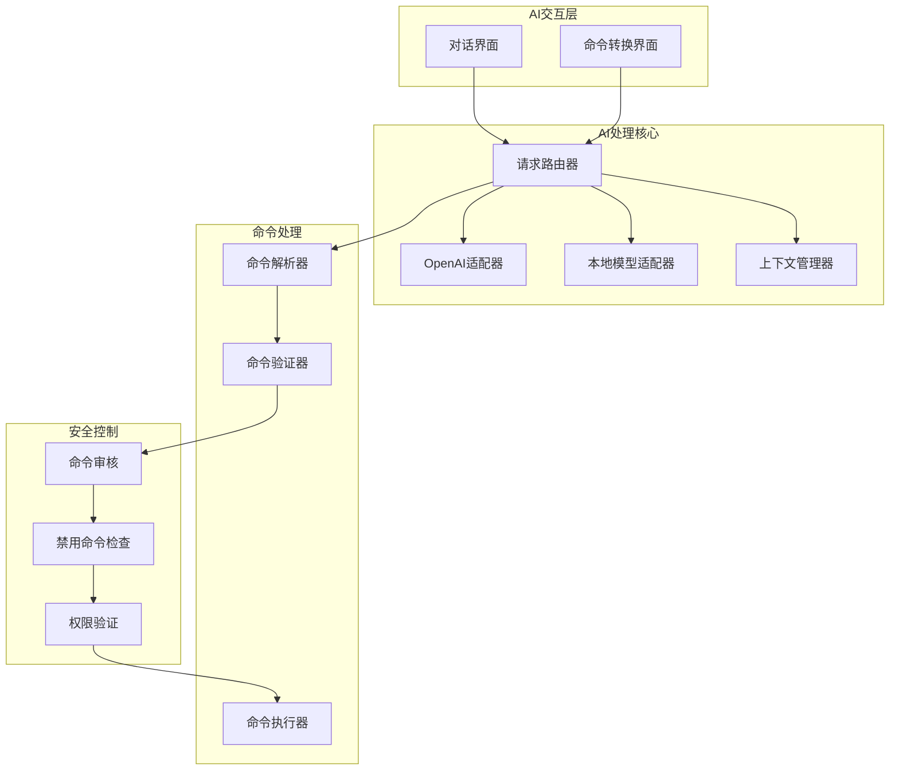

#### 3.3.2 自然语言命令转换流程
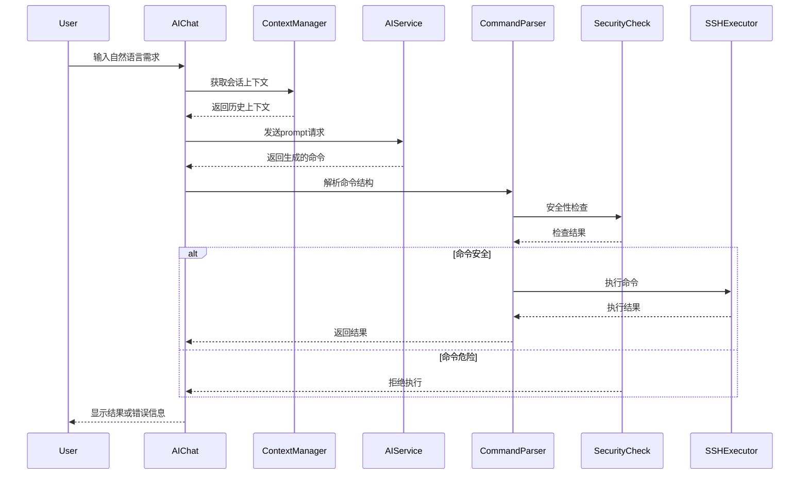

### 3.4 安全管控模块

#### 3.4.1 命令审核机制
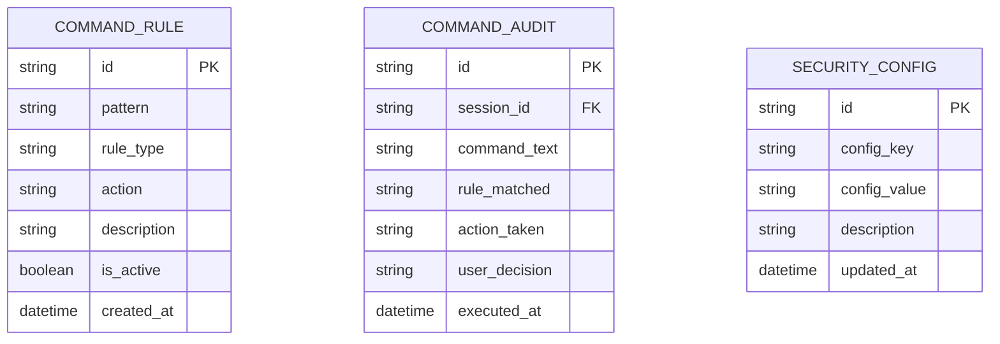

#### 3.4.2 安全检查流程
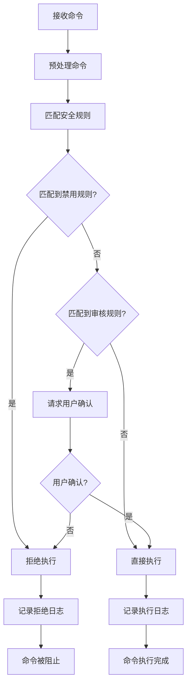

## 4. 数据安全设计

### 4.1 本地加密存储
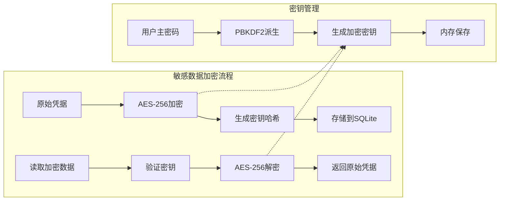

### 4.2 数据隔离策略
| 数据类型 | 存储位置 | 加密方式 | 访问控制 |
|---------|---------|---------|----------|
| 主机密码 | 本地SQLite | AES-256 | 主密码验证 |
| SSH私钥 | 本地SQLite | AES-256 | 主密码验证 |
| 会话记录 | 本地SQLite | 明文 | 文件系统权限 |
| 审计日志 | 本地文件 | 明文 | 文件系统权限 |
| 用户配置 | 本地SQLite | 明文 | 文件系统权限 |

## 5. 用户界面设计

### 5.1 主要界面布局
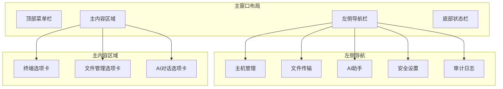

### 5.2 关键界面组件

#### 5.2.1 主机管理界面组件
- **主机列表树**: 支持分组展示和搜索过滤
- **连接状态指示器**: 实时显示连接状态
- **快速连接按钮**: 一键连接常用主机
- **主机信息编辑器**: 表单式的主机信息配置

#### 5.2.2 终端界面组件  
- **多标签终端**: 支持同时连接多个主机
- **终端模拟器**: 完整的xterm.js终端实现
- **AI命令助手**: 侧边栏集成的AI建议面板
- **命令历史**: 可搜索的命令执行历史

#### 5.2.3 文件传输界面组件
- **双面板文件浏览器**: 本地和远程文件同步浏览
- **传输任务队列**: 显示正在进行的传输任务
- **进度监控**: 实时显示传输进度和速度
- **断点续传控制**: 支持暂停、恢复、取消操作

## 6. API接口设计

### 6.1 主机管理接口
```
GET /api/hosts - 获取主机列表
POST /api/hosts - 创建新主机
PUT /api/hosts/:id - 更新主机信息
DELETE /api/hosts/:id - 删除主机
POST /api/hosts/:id/connect - 建立SSH连接
DELETE /api/hosts/:id/disconnect - 断开SSH连接
GET /api/hosts/:id/status - 获取连接状态
```

### 6.2 文件传输接口
```
POST /api/transfer/upload - 上传文件
POST /api/transfer/download - 下载文件
GET /api/transfer/tasks - 获取传输任务列表
PUT /api/transfer/tasks/:id/pause - 暂停传输任务
PUT /api/transfer/tasks/:id/resume - 恢复传输任务
DELETE /api/transfer/tasks/:id - 取消传输任务
```

### 6.3 AI交互接口
```
POST /api/ai/chat - AI对话接口
POST /api/ai/command - 自然语言命令转换
GET /api/ai/models - 获取可用AI模型列表
PUT /api/ai/config - 更新AI配置
GET /api/ai/history - 获取对话历史
```

### 6.4 安全管控接口
```
GET /api/security/rules - 获取安全规则列表
POST /api/security/rules - 创建安全规则
PUT /api/security/rules/:id - 更新安全规则
DELETE /api/security/rules/:id - 删除安全规则
POST /api/security/audit - 记录审计日志
GET /api/security/audit - 查询审计日志
```

## 7. 测试策略

### 7.1 单元测试覆盖
- **SSH连接模块**: 测试连接建立、认证、命令执行
- **文件传输模块**: 测试上传下载、断点续传、错误处理
- **加密服务模块**: 测试数据加密解密、密钥管理
- **AI交互模块**: 测试命令转换、上下文管理
- **安全控制模块**: 测试规则匹配、命令审核

### 7.2 集成测试方案
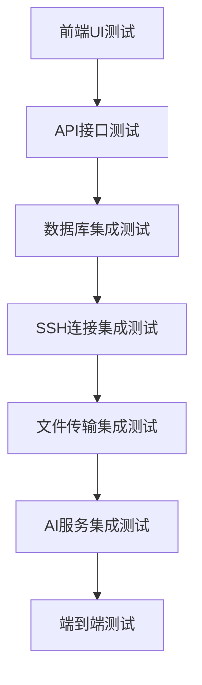

### 7.3 测试环境配置
- **本地测试**: 使用Docker容器模拟SSH服务器
- **网络测试**: 模拟网络延迟和断连场景
- **安全测试**: 验证加密算法和权限控制
- **性能测试**: 大文件传输和并发连接测试
- **兼容性测试**: 跨平台功能一致性验证

## 8. 部署架构设计

### 8.1 应用打包策略
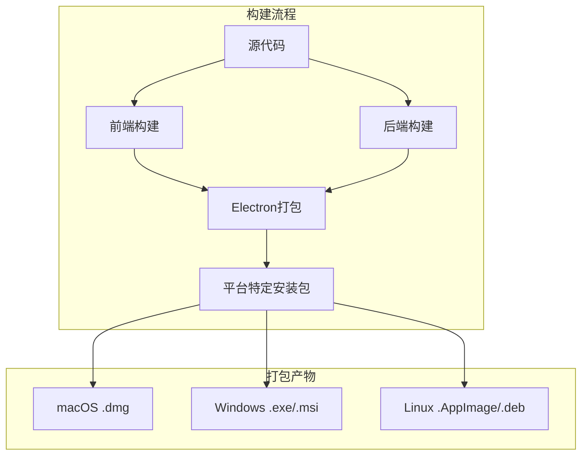

### 8.2 企业级部署方案

#### 8.2.1 单机部署模式
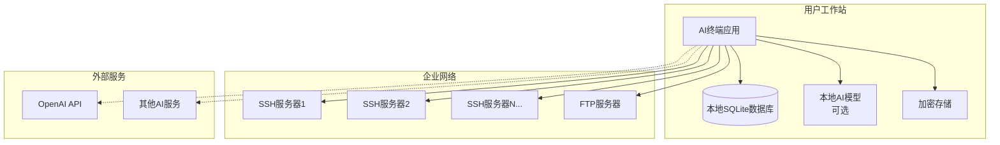

#### 8.2.2 集中管理模式
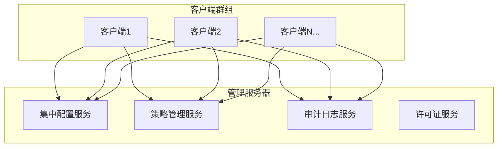

### 8.3 配置管理策略

#### 8.3.1 配置文件结构
```
~/.ai-terminal/
├── config/
│   ├── app.json           # 应用主配置
│   ├── security.json      # 安全策略配置
│   ├── ai-models.json     # AI模型配置
│   └── ui-preferences.json # 界面偏好设置
├── data/
│   ├── hosts.db          # 主机信息数据库
│   ├── sessions.db       # 会话记录数据库
│   └── audit.db          # 审计日志数据库
├── logs/
│   ├── app.log           # 应用日志
│   ├── error.log         # 错误日志
│   └── audit.log         # 操作审计日志
└── temp/
    └── transfers/        # 传输临时文件
```

#### 8.3.2 配置热重载机制
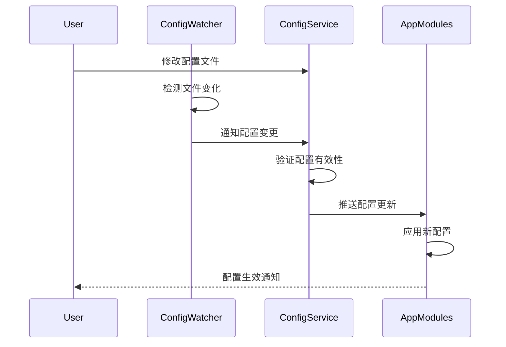

## 9. 性能优化方案

### 9.1 连接池管理
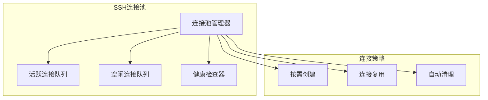

### 9.2 文件传输优化

#### 9.2.1 多线程并发传输
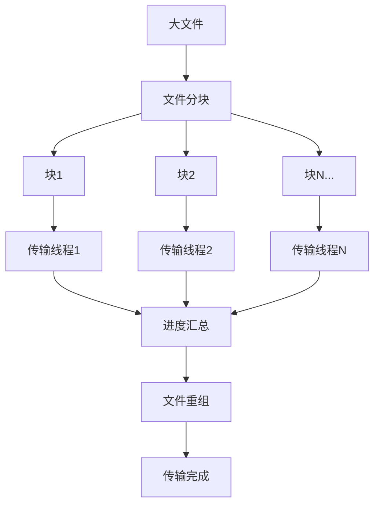

#### 9.2.2 传输性能参数
| 参数名称 | 默认值 | 说明 |
|---------|-------|------|
| 并发线程数 | 4 | 同时传输的块数量 |
| 块大小 | 1MB | 每个传输块的大小 |
| 重试次数 | 3 | 失败重试最大次数 |
| 超时时间 | 30s | 单个块传输超时 |
| 缓冲区大小 | 64KB | 网络缓冲区大小 |

### 9.3 内存管理优化

#### 9.3.1 终端缓冲区管理
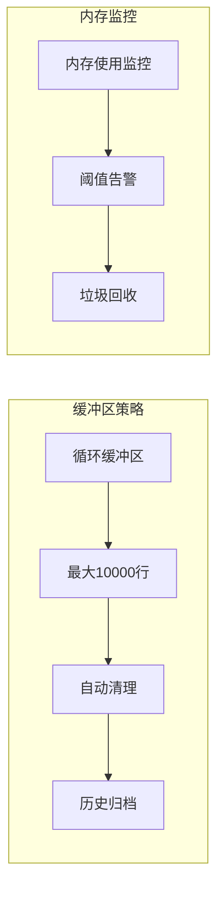

## 10. 安全合规设计

### 10.1 数据分类与保护

| 数据分类 | 敏感级别 | 保护措施 | 存储位置 |
|---------|---------|---------|----------|
| 用户密码 | 高敏感 | AES-256加密 + 主密码保护 | 本地加密数据库 |
| SSH私钥 | 高敏感 | AES-256加密 + 主密码保护 | 本地加密数据库 |
| 主机地址 | 中敏感 | 本地存储 + 文件权限控制 | 本地数据库 |
| 命令历史 | 中敏感 | 本地存储 + 可选加密 | 本地数据库 |
| 审计日志 | 低敏感 | 明文存储 + 文件权限控制 | 本地日志文件 |

### 10.2 权限控制矩阵

```mermaid
graph TB
    subgraph "用户角色"
        Admin[管理员]
        PowerUser[高级用户]
        RegularUser[普通用户]
        GuestUser[访客用户]
    end
    
    subgraph "权限功能"
        SSH[SSH连接]
        FTP[文件传输]
        AI[AI交互]
        Config[配置管理]
        Audit[审计查看]
        Security[安全设置]
    end
    
    Admin --> SSH
    Admin --> FTP
    Admin --> AI
    Admin --> Config
    Admin --> Audit
    Admin --> Security
    
    PowerUser --> SSH
    PowerUser --> FTP
    PowerUser --> AI
    PowerUser --> Config
    PowerUser --> Audit
    
    RegularUser --> SSH
    RegularUser --> FTP
    RegularUser --> AI
    
    GuestUser --> SSH
```

### 10.3 合规审计要求

#### 10.3.1 审计事件定义
```mermaid
erDiagram
    AUDIT_EVENT {
        string id PK
        string event_type
        string user_id
        string target_host
        string command_executed
        string event_result
        string ip_address
        string user_agent
        datetime timestamp
        string risk_level
    }
    
    AUDIT_RULE {
        string id PK
        string rule_name
        string event_pattern
        string notification_level
        boolean is_active
        datetime created_at
    }
    
    AUDIT_EVENT ||--o{ AUDIT_RULE : triggers
```

#### 10.3.2 合规报告生成
```mermaid
flowchart TD
    A[原始审计数据] --> B[数据聚合]
    B --> C[风险分析]
    C --> D[合规检查]
    D --> E[报告生成]
    
    subgraph "报告类型"
        F[日报告]
        G[周报告]
        H[月报告]
        I[年度报告]
    end
    
    E --> F
    E --> G
    E --> H
    E --> I
```

## 11. 国际化与本地化

### 11.1 多语言支持架构
```mermaid
graph TB
    subgraph "语言资源"
        ZH[中文语言包]
        EN[英文语言包]
        JP[日文语言包]
        KR[韩文语言包]
    end
    
    subgraph "本地化组件"
        I18N[国际化引擎]
        Formatter[格式化器]
        DateFormat[日期格式化]
        NumberFormat[数字格式化]
    end
    
    subgraph "应用界面"
        UI[用户界面]
        Messages[消息提示]
        Help[帮助文档]
    end
    
    ZH --> I18N
    EN --> I18N
    JP --> I18N
    KR --> I18N
    
    I18N --> Formatter
    I18N --> DateFormat
    I18N --> NumberFormat
    
    Formatter --> UI
    Formatter --> Messages
    Formatter --> Help
```

### 11.2 支持的语言列表

| 语言 | 语言代码 | 完成度 | 维护状态 |
|-----|---------|-------|----------|
| 简体中文 | zh-CN | 100% | 主要语言 |
| 英文 | en-US | 100% | 主要语言 |
| 繁体中文 | zh-TW | 95% | 维护中 |
| 日文 | ja-JP | 80% | 计划中 |
| 韩文 | ko-KR | 70% | 计划中 |

## 12. 扩展性设计

### 12.1 插件系统架构
```mermaid
graph TB
    subgraph "核心系统"
        Core[应用核心]
        PluginManager[插件管理器]
        API[插件API]
    end
    
    subgraph "官方插件"
        SSHPlugin[SSH增强插件]
        ThemePlugin[主题插件]
        ScriptPlugin[脚本执行插件]
    end
    
    subgraph "第三方插件"
        CustomPlugin1[自定义插件1]
        CustomPlugin2[自定义插件2]
    end
    
    Core --> PluginManager
    PluginManager --> API
    
    API --> SSHPlugin
    API --> ThemePlugin
    API --> ScriptPlugin
    API --> CustomPlugin1
    API --> CustomPlugin2
```

### 12.2 插件开发规范

#### 12.2.1 插件接口定义
```javascript
// 插件基础接口
class BasePlugin {
  constructor(name, version) {
    this.name = name;
    this.version = version;
  }
  
  // 插件初始化
  async initialize(context) {
    // 实现初始化逻辑
  }
  
  // 插件卸载
  async destroy() {
    // 实现清理逻辑
  }
  
  // 获取插件信息
  getInfo() {
    return {
      name: this.name,
      version: this.version,
      description: '插件描述',
      author: '插件作者'
    };
  }
}
```

#### 12.2.2 插件生命周期
```mermaid
sequenceDiagram
    participant App
    participant PluginManager
    participant Plugin
    
    App->>PluginManager: 加载插件
    PluginManager->>Plugin: 创建实例
    PluginManager->>Plugin: initialize()
    Plugin-->>PluginManager: 初始化完成
    
    loop 运行期间
        App->>PluginManager: 调用插件功能
        PluginManager->>Plugin: 执行方法
        Plugin-->>PluginManager: 返回结果
        PluginManager-->>App: 返回结果
    end
    
    App->>PluginManager: 卸载插件
    PluginManager->>Plugin: destroy()
    Plugin-->>PluginManager: 清理完成
    PluginManager->>PluginManager: 移除插件引用
```

### 12.3 主题系统设计

#### 12.3.1 主题配置结构
```json
{
  "theme": {
    "name": "dark-pro",
    "displayName": "Dark Pro",
    "version": "1.0.0",
    "colors": {
      "primary": "#007ACC",
      "secondary": "#FF6B6B",
      "background": "#1E1E1E",
      "surface": "#252526",
      "text": "#CCCCCC",
      "textSecondary": "#969696"
    },
    "terminal": {
      "background": "#0C0C0C",
      "foreground": "#CCCCCC",
      "cursor": "#FFFFFF",
      "selection": "#264F78"
    },
    "syntax": {
      "keyword": "#569CD6",
      "string": "#CE9178",
      "comment": "#6A9955",
      "number": "#B5CEA8"
    }
  }
}
```

## 13. 监控与运维

### 13.1 应用监控指标

| 监控类别 | 具体指标 | 阈值设置 | 告警级别 |
|---------|---------|---------|----------|
| 性能监控 | CPU使用率 | >80% | 警告 |
| 性能监控 | 内存使用率 | >90% | 严重 |
| 连接监控 | SSH连接数 | >50 | 信息 |
| 连接监控 | 连接失败率 | >10% | 警告 |
| 传输监控 | 传输任务队列长度 | >20 | 警告 |
| 传输监控 | 传输失败率 | >5% | 警告 |

### 13.2 日志管理策略

#### 13.2.1 日志级别定义
```mermaid
graph TD
    ERROR[ERROR - 错误级别] --> WARN[WARN - 警告级别]
    WARN --> INFO[INFO - 信息级别]
    INFO --> DEBUG[DEBUG - 调试级别]
    DEBUG --> TRACE[TRACE - 跟踪级别]
    
    style ERROR fill:#ff6b6b
    style WARN fill:#ffa726
    style INFO fill:#66bb6a
    style DEBUG fill:#42a5f5
    style TRACE fill:#9575cd
```

#### 13.2.2 日志轮转配置
```json
{
  "logging": {
    "level": "INFO",
    "rotation": {
      "maxSize": "10MB",
      "maxFiles": 5,
      "compress": true
    },
    "destinations": [
      {
        "type": "file",
        "filename": "app.log",
        "level": "INFO"
      },
      {
        "type": "file",
        "filename": "error.log",
        "level": "ERROR"
      },
      {
        "type": "console",
        "level": "DEBUG"
      }
    ]
  }
}
```

### 13.3 故障恢复机制

```mermaid
flowchart TD
    A[检测到故障] --> B{故障类型判断}
    B -->|连接故障| C[自动重连机制]
    B -->|传输故障| D[断点续传恢复]
    B -->|应用崩溃| E[自动重启机制]
    B -->|数据损坏| F[备份恢复机制]
    
    C --> G[记录故障日志]
    D --> G
    E --> G
    F --> G
    
    G --> H[通知用户]
    H --> I[故障处理完成]
```