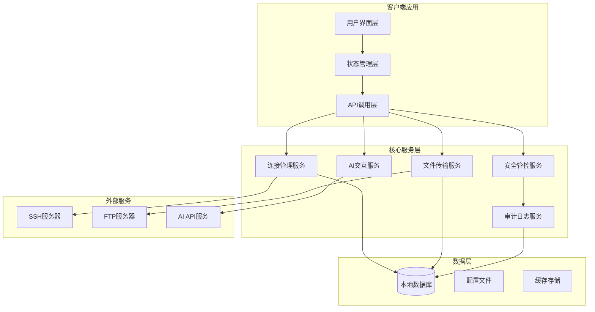
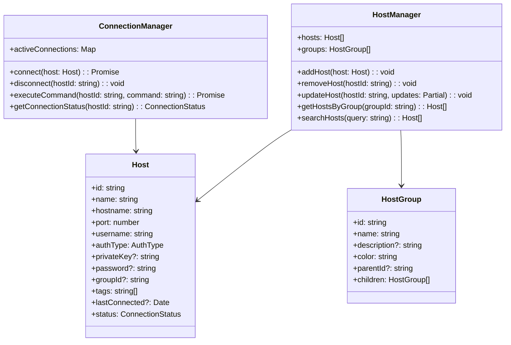
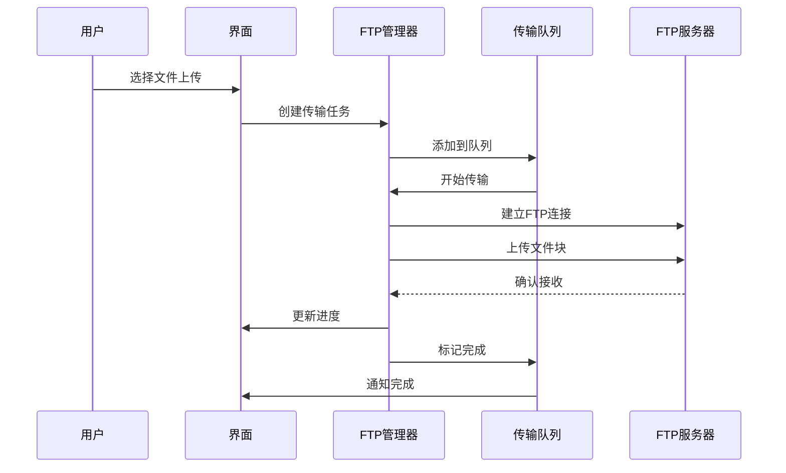
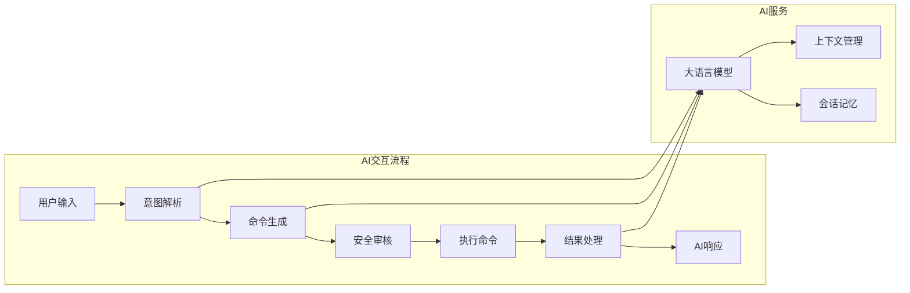
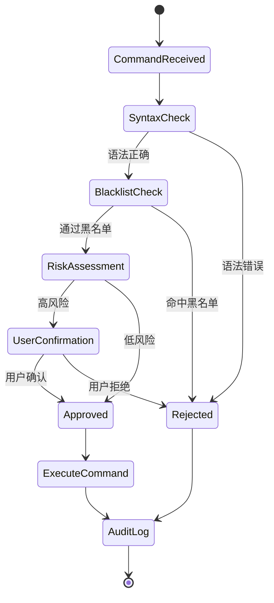
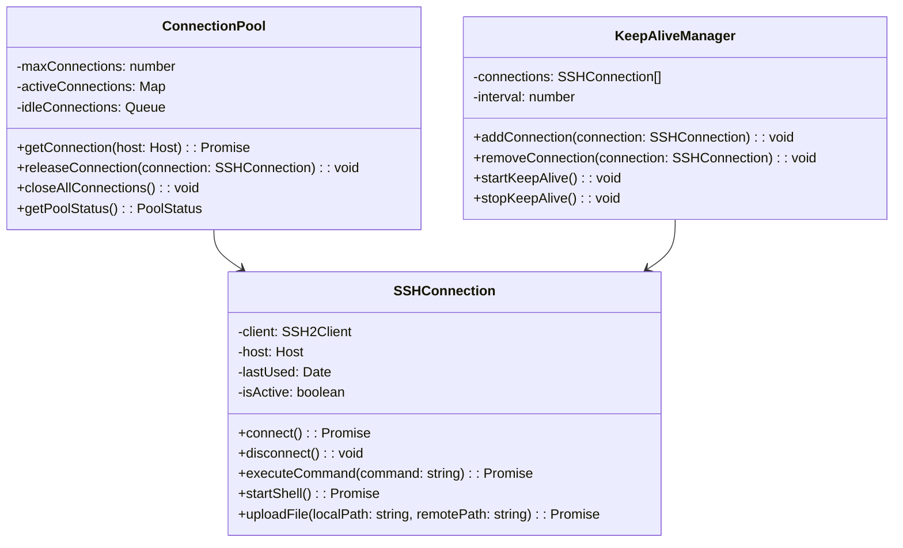
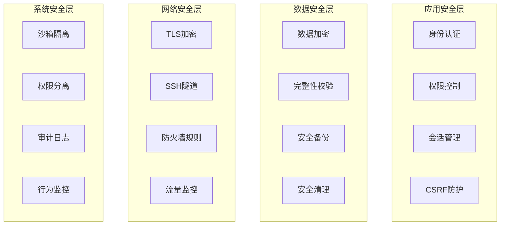
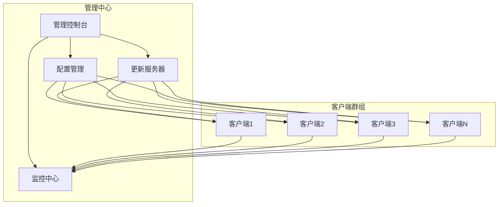

# 跨平台AI终端工具设计文档

## 1. 概述

### 1.1 项目简介
开发一款跨平台的AI终端工具，结合传统终端管理功能与人工智能技术，为用户提供智能化的远程主机管理体验。该工具将支持多终端管理、文件传输、AI交互和安全管控等核心功能。

### 1.2 核心特性
- **跨平台兼容性**: 支持macOS、Windows、Linux操作系统
- **多终端管理**: SSH资产管理、主机分组、标签管理
- **文件传输**: FTP协议支持、断点续传、大文件传输
- **AI交互**: 自然语言到命令转换、AI对话系统
- **安全管控**: 命令审核、操作审计、权限管理

### 1.3 目标用户
- 系统管理员
- 运维工程师
- 开发人员
- 企业IT团队

## 2. 技术栈与依赖

### 2.1 核心技术选择
- **跨平台框架**: Electron + Vue
- **后端语言**: PYYthon
- **数据库**: SQLite (本地) + 可选企业级数据库
- **网络通信**: SSH2, FTP客户端库
- **AI集成**: OpenAI API / 本地大模型
- **安全加密**: crypto-js, node-forge

### 2.2 主要依赖库
```
electron: 主应用框架
ssh2: SSH连接管理
node-ftp: FTP文件传输
sqlite3: 本地数据存储
crypto-js: 数据加密
ws: WebSocket通信
winston: 日志记录
```

## 3. 系统架构

### 3.1 整体架构图



### 3.2 应用架构分层

#### 3.2.1 展示层 (Presentation Layer)
- **主界面组件**: 终端列表、连接状态、AI对话界面
- **文件管理组件**: 文件浏览器、传输进度、队列管理
- **设置组件**: 主机配置、安全设置、AI配置
- **监控组件**: 连接监控、性能监控、日志查看

#### 3.2.2 业务逻辑层 (Business Layer)
- **连接管理器**: SSH连接池、会话管理、重连机制
- **文件传输器**: FTP客户端、传输队列、断点续传
- **AI处理器**: 命令解析、自然语言处理、响应生成
- **安全控制器**: 命令过滤、权限验证、审计记录

#### 3.2.3 数据访问层 (Data Layer)
- **主机信息存储**: 连接配置、认证信息、分组标签
- **文件传输记录**: 传输历史、失败重试、进度跟踪
- **AI会话存储**: 对话历史、用户偏好、学习数据
- **审计日志存储**: 操作记录、安全事件、系统日志

## 4. 核心功能模块设计

### 4.1 多终端管理模块

#### 4.1.1 SSH资产管理


#### 4.1.2 认证方式支持
- **密码认证**: 加密存储用户密码
- **密钥认证**: 支持RSA、DSA、ECDSA、Ed25519密钥
- **双因素认证**: 支持TOTP、短信验证码
- **证书认证**: 支持X.509证书认证

#### 4.1.3 主机分组与标签
- **层级分组**: 支持多层级主机分组
- **智能标签**: 自动标签生成和手动标签管理
- **批量操作**: 支持批量连接、命令执行、配置更新
- **搜索过滤**: 基于名称、标签、状态的快速搜索

### 4.2 文件传输模块

#### 4.2.1 FTP功能设计


#### 4.2.2 断点续传机制
- **文件分块**: 将大文件分割为固定大小的块
- **进度跟踪**: 记录每个块的传输状态
- **失败重试**: 自动重试失败的文件块
- **完整性校验**: MD5/SHA256校验确保文件完整性

#### 4.2.3 传输队列管理
- **优先级队列**: 支持高、中、低优先级设置
- **并发控制**: 可配置的并发传输数量限制
- **带宽限制**: 支持上传下载带宽限制
- **暂停恢复**: 支持传输任务的暂停和恢复

### 4.3 AI交互模块

#### 4.3.1 AI对话系统架构


#### 4.3.2 自然语言到命令转换
- **意图识别**: 识别用户的操作意图（查看、编辑、搜索等）
- **参数提取**: 从自然语言中提取命令参数
- **命令生成**: 生成对应的Shell命令
- **安全过滤**: 过滤危险命令和参数

#### 4.3.3 AI自主思考能力
- **上下文理解**: 维护对话上下文和系统状态
- **推理决策**: 基于当前状态进行逻辑推理
- **学习适应**: 从用户行为中学习偏好
- **主动建议**: 主动提供优化建议和最佳实践

### 4.4 安全管控模块

#### 4.4.1 命令审核机制


#### 4.4.2 权限管理系统
- **角色定义**: 管理员、操作员、只读用户等角色
- **权限粒度**: 主机级、命令级、功能级权限控制
- **动态授权**: 基于时间、地点、设备的动态权限
- **最小权限原则**: 默认最小权限，按需授权

#### 4.4.3 审计日志系统
- **操作记录**: 记录所有用户操作和系统事件
- **日志格式**: 结构化日志，支持JSON格式
- **日志轮转**: 自动日志归档和清理
- **合规性**: 满足SOX、PCI DSS等合规要求

## 5. 用户界面设计

### 5.1 主界面布局

#### 5.1.1 界面区域划分
```
┌─────────────────────────────────────────────────────────┐
│ 菜单栏                                                    │
├─────────────┬───────────────────────────────────────────┤
│             │ 主机列表                                     │
│   侧边栏     ├───────────────────────────────────────────┤
│             │ 终端区域                                     │
│  - 主机管理  │                                           │
│  - 文件传输  │                                           │
│  - AI助手   │                                           │
│  - 设置     │                                           │
│             ├───────────────────────────────────────────┤
│             │ AI对话区域                                  │
└─────────────┴───────────────────────────────────────────┘
```

#### 5.1.2 响应式设计
- **自适应布局**: 支持不同屏幕尺寸和分辨率
- **主题切换**: 支持亮色、暗色主题
- **字体缩放**: 支持界面字体大小调整
- **快捷键**: 丰富的键盘快捷键支持

### 5.2 功能界面设计

#### 5.2.1 主机管理界面
- **主机列表**: 显示主机名、状态、最后连接时间
- **连接状态**: 实时显示连接状态和网络延迟
- **快速操作**: 连接、编辑、删除、复制等快捷操作
- **批量管理**: 支持多选和批量操作

#### 5.2.2 文件传输界面
- **双面板**: 本地文件浏览器和远程文件浏览器
- **传输队列**: 显示传输任务列表和进度
- **拖拽上传**: 支持文件拖拽上传功能
- **同步功能**: 文件夹同步和比较功能

#### 5.2.3 AI助手界面
- **对话窗口**: 类似聊天应用的对话界面
- **命令预览**: 在执行前显示生成的命令
- **历史记录**: 保存和搜索对话历史
- **快速操作**: 常用AI功能的快捷按钮

## 6. 数据模型设计

### 6.1 核心数据实体

#### 6.1.1 主机信息模型
```sql
CREATE TABLE hosts (
    id TEXT PRIMARY KEY,
    name TEXT NOT NULL,
    hostname TEXT NOT NULL,
    port INTEGER DEFAULT 22,
    username TEXT NOT NULL,
    auth_type TEXT CHECK(auth_type IN ('password', 'key', '2fa')) NOT NULL,
    encrypted_password TEXT,
    private_key_path TEXT,
    group_id TEXT,
    tags TEXT, -- JSON array
    created_at DATETIME DEFAULT CURRENT_TIMESTAMP,
    updated_at DATETIME DEFAULT CURRENT_TIMESTAMP,
    last_connected_at DATETIME,
    connection_count INTEGER DEFAULT 0,
    FOREIGN KEY (group_id) REFERENCES host_groups(id)
);
```

#### 6.1.2 文件传输记录模型
```sql
CREATE TABLE file_transfers (
    id TEXT PRIMARY KEY,
    host_id TEXT NOT NULL,
    type TEXT CHECK(type IN ('upload', 'download')) NOT NULL,
    local_path TEXT NOT NULL,
    remote_path TEXT NOT NULL,
    file_size INTEGER,
    transferred_size INTEGER DEFAULT 0,
    status TEXT CHECK(status IN ('pending', 'transferring', 'completed', 'failed', 'paused')) DEFAULT 'pending',
    created_at DATETIME DEFAULT CURRENT_TIMESTAMP,
    completed_at DATETIME,
    error_message TEXT,
    FOREIGN KEY (host_id) REFERENCES hosts(id)
);
```

#### 6.1.3 AI会话模型
```sql
CREATE TABLE ai_sessions (
    id TEXT PRIMARY KEY,
    host_id TEXT,
    messages TEXT, -- JSON array of messages
    context TEXT, -- JSON object for session context
    created_at DATETIME DEFAULT CURRENT_TIMESTAMP,
    updated_at DATETIME DEFAULT CURRENT_TIMESTAMP,
    FOREIGN KEY (host_id) REFERENCES hosts(id)
);
```

#### 6.1.4 审计日志模型
```sql
CREATE TABLE audit_logs (
    id TEXT PRIMARY KEY,
    user_id TEXT,
    host_id TEXT,
    action TEXT NOT NULL,
    command TEXT,
    result TEXT,
    risk_level TEXT CHECK(risk_level IN ('low', 'medium', 'high')) DEFAULT 'low',
    ip_address TEXT,
    user_agent TEXT,
    created_at DATETIME DEFAULT CURRENT_TIMESTAMP,
    FOREIGN KEY (host_id) REFERENCES hosts(id)
);
```

### 6.2 数据加密策略

#### 6.2.1 敏感数据加密
- **密码加密**: 使用AES-256-GCM加密存储密码
- **密钥加密**: 使用主密钥加密私钥文件
- **传输加密**: 所有网络传输使用TLS/SSL
- **内存保护**: 敏感数据在内存中的保护机制

#### 6.2.2 密钥管理
- **主密钥**: 基于用户密码和设备信息生成
- **密钥轮转**: 定期更新加密密钥
- **密钥恢复**: 提供安全的密钥恢复机制
- **硬件安全**: 支持硬件安全模块(HSM)

## 7. 网络通信架构

### 7.1 SSH连接管理

#### 7.1.1 连接池设计


#### 7.1.2 重连机制
- **自动重连**: 连接断开后自动尝试重连
- **指数退避**: 重连间隔逐渐增加
- **最大重试**: 设置最大重连次数限制
- **连接检测**: 定期检测连接健康状态

### 7.2 FTP传输优化

#### 7.2.1 并发传输控制
- **连接复用**: 复用FTP连接减少握手开销
- **并发限制**: 避免过多并发连接影响性能
- **队列管理**: 智能调度传输任务
- **带宽控制**: 动态调整传输速度

#### 7.2.2 传输协议选择
- **FTP/FTPS**: 支持明文和加密FTP
- **SFTP**: 基于SSH的安全文件传输
- **SCP**: 简单的文件复制协议
- **自动选择**: 根据服务器能力自动选择最佳协议

## 8. 性能优化策略

### 8.1 前端性能优化

#### 8.1.1 渲染优化
- **虚拟滚动**: 大列表数据的虚拟滚动
- **懒加载**: 按需加载组件和数据
- **缓存策略**: 智能缓存频繁访问的数据
- **防抖节流**: 减少不必要的API调用

#### 8.1.2 内存管理
- **组件卸载**: 及时清理不用的组件和事件监听
- **内存监控**: 监控内存使用情况
- **垃圾回收**: 主动触发垃圾回收
- **资源释放**: 及时释放大对象和文件句柄

### 8.2 后端性能优化

#### 8.2.1 数据库优化
- **索引优化**: 为常用查询创建合适的索引
- **查询优化**: 优化复杂的SQL查询
- **连接池**: 数据库连接池管理
- **缓存层**: Redis缓存热点数据

#### 8.2.2 网络优化
- **连接复用**: 复用网络连接
- **数据压缩**: 压缩传输数据减少带宽
- **CDN加速**: 静态资源CDN分发
- **负载均衡**: 服务器负载均衡

## 9. 安全架构设计

### 9.1 多层安全防护

#### 9.1.1 应用层安全


#### 9.1.2 威胁检测与防护
- **异常检测**: 检测异常登录和操作行为
- **恶意命令**: 识别和阻止恶意命令执行
- **暴力破解**: 防护暴力破解攻击
- **数据泄露**: 检测和防止敏感数据泄露

### 9.2 合规性设计

#### 9.2.1 数据保护合规
- **GDPR合规**: 符合欧盟数据保护法规
- **数据分类**: 对敏感数据进行分类标记
- **访问控制**: 基于角色的细粒度访问控制
- **数据审计**: 完整的数据访问审计跟踪

#### 9.2.2 企业安全标准
- **ISO 27001**: 信息安全管理体系
- **SOC 2**: 安全运营中心标准
- **NIST框架**: 网络安全框架
- **行业标准**: 满足特定行业安全要求

## 10. 部署与运维

### 10.1 打包与分发

#### 10.1.1 应用打包
```yaml
# 打包配置
build:
  appId: com.company.ai-terminal
  productName: AI Terminal
  directories:
    output: dist
  files:
    - src/**/*
    - node_modules/**/*
    - package.json
  extraResources:
    - assets/**/*
  
# 平台特定配置
mac:
  category: public.app-category.developer-tools
  target: dmg
  
windows:
  target: nsis
  
linux:
  target: AppImage
```

#### 10.1.2 自动更新机制
- **版本检测**: 自动检测新版本
- **增量更新**: 只下载变更的文件
- **回滚机制**: 更新失败时自动回滚
- **更新策略**: 可配置的更新策略

### 10.2 企业级部署

#### 10.2.1 集中管理方案


#### 10.2.2 配置管理
- **集中配置**: 统一管理客户端配置
- **配置分发**: 自动推送配置更新
- **权限模板**: 预定义的权限模板
- **合规检查**: 自动检查配置合规性

### 10.3 监控与运维

#### 10.3.1 应用监控
- **性能监控**: CPU、内存、网络使用情况
- **错误监控**: 异常和错误的自动收集
- **用户行为**: 用户操作和使用模式分析
- **健康检查**: 应用组件健康状态检查

#### 10.3.2 运维自动化
- **日志收集**: 自动收集和分析日志
- **告警机制**: 异常情况自动告警
- **故障恢复**: 自动故障检测和恢复
- **性能调优**: 基于监控数据的自动调优

## 11. 扩展性设计

### 11.1 插件系统架构

#### 11.1.1 插件接口设计
```typescript
interface Plugin {
  name: string;
  version: string;
  description: string;
  author: string;
  
  // 生命周期钩子
  onActivate(): void;
  onDeactivate(): void;
  
  // 功能扩展点
  contributes: {
    commands?: Command[];
    menus?: MenuItem[];
    views?: ViewContribution[];
    themes?: Theme[];
  };
}

interface Command {
  id: string;
  title: string;
  category?: string;
  handler: CommandHandler;
}

interface ViewContribution {
  id: string;
  title: string;
  location: ViewLocation;
  component: React.ComponentType;
}
```

#### 11.1.2 插件加载机制
- **动态加载**: 运行时动态加载和卸载插件
- **沙箱隔离**: 插件运行在独立的沙箱环境
- **API限制**: 限制插件可访问的API范围
- **权限管理**: 插件权限申请和授权机制

### 11.2 API扩展能力

#### 11.2.1 内部API设计
- **连接API**: 提供SSH连接管理接口
- **文件API**: 提供文件操作接口
- **AI API**: 提供AI交互接口
- **配置API**: 提供配置读写接口

#### 11.2.2 第三方集成
- **Webhook支持**: 支持外部系统webhook集成
- **REST API**: 提供REST API供外部调用
- **SSO集成**: 支持企业单点登录系统
- **监控集成**: 集成企业监控和告警系统

## 12. 测试策略

### 12.1 测试层次设计

#### 12.1.1 单元测试
```typescript
// SSH连接管理器测试示例
describe('ConnectionManager', () => {
  let connectionManager: ConnectionManager;
  let mockHost: Host;
  
  beforeEach(() => {
    connectionManager = new ConnectionManager();
    mockHost = {
      id: 'test-host',
      name: 'Test Host',
      hostname: '192.168.1.100',
      port: 22,
      username: 'testuser',
      authType: 'password',
      password: 'testpass'
    };
  });
  
  test('should connect to host successfully', async () => {
    const connection = await connectionManager.connect(mockHost);
    expect(connection).toBeDefined();
    expect(connection.isConnected()).toBe(true);
  });
  
  test('should handle connection failure', async () => {
    const invalidHost = { ...mockHost, hostname: 'invalid-host' };
    await expect(connectionManager.connect(invalidHost))
      .rejects.toThrow('Connection failed');
  });
});
```

#### 12.1.2 集成测试
- **SSH连接测试**: 测试真实SSH服务器连接
- **文件传输测试**: 测试FTP/SFTP文件传输功能
- **AI集成测试**: 测试AI服务集成
- **数据库测试**: 测试数据持久化功能

### 12.2 端到端测试

#### 12.2.1 UI自动化测试
```typescript
// 使用Playwright进行E2E测试
test('user can add and connect to host', async ({ page }) => {
  await page.goto('/');
  
  // 点击添加主机按钮
  await page.click('[data-testid="add-host-button"]');
  
  // 填写主机信息
  await page.fill('[data-testid="host-name"]', 'Test Server');
  await page.fill('[data-testid="hostname"]', '192.168.1.100');
  await page.fill('[data-testid="username"]', 'testuser');
  await page.fill('[data-testid="password"]', 'testpass');
  
  // 保存主机
  await page.click('[data-testid="save-host"]');
  
  // 验证主机已添加
  await expect(page.locator('[data-testid="host-list"]')).toContainText('Test Server');
  
  // 连接主机
  await page.click('[data-testid="connect-button"]');
  
  // 验证连接成功
  await expect(page.locator('[data-testid="connection-status"]')).toContainText('Connected');
});
```

#### 12.2.2 性能测试
- **连接性能**: 测试大量并发SSH连接
- **文件传输性能**: 测试大文件传输速度
- **UI响应性能**: 测试界面响应时间
- **内存性能**: 测试长时间运行的内存使用

### 12.3 安全测试

#### 12.3.1 渗透测试
- **输入验证**: 测试各种恶意输入
- **权限绕过**: 测试权限控制机制
- **数据泄露**: 测试敏感数据保护
- **网络安全**: 测试网络通信安全

#### 12.3.2 漏洞扫描
- **依赖库扫描**: 扫描第三方库漏洞
- **代码安全扫描**: 静态代码安全分析
- **配置安全**: 检查安全配置项
- **合规性检查**: 验证安全合规要求